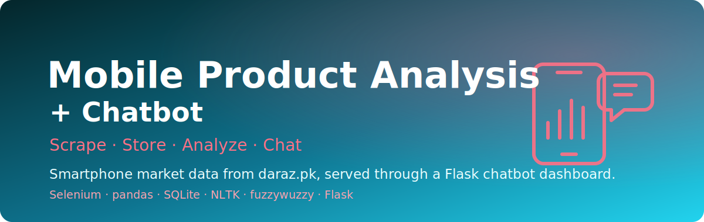

<p align="center">
  
</p>

<h1 align="center">Mobile Product Analysis + Chatbot</h1>

<p align="center"><em>Scrape smartphone listings from daraz.pk, store them, and explore the market through an NLP chatbot dashboard.</em></p>

<p align="center">
  
  
  
  
  
</p>

**Mobile Product Analysis + Chatbot** is an end-to-end data project that scrapes mobile-phone listings from **daraz.pk** with **Selenium**, stores the products and reviews in **SQLite** and CSV via **pandas**, and exposes the data through a **Flask** web app. The app pairs a metrics dashboard with a rule-based **NLP chatbot** (built on **NLTK** tokenization/stopwords and **fuzzywuzzy** fuzzy matching) so you can ask natural-language questions about price, ratings, brands and recommendations. Review text is additionally scored with NLTK's `SentimentIntensityAnalyzer`.

> Turn a raw smartphone marketplace into something you can actually query in plain English.

---

## ✨ Features

- **Selenium scraper** that walks pages 2–6 of `daraz.pk/smartphones`, collecting product ID, name, price, brand, rating, total ratings, questions, specifications and product links — plus per-product reviews and usernames.
- **Dual storage**: writes to CSV (`product.csv`, `reviews.csv`) and to a **SQLite** database (`my_database.db`, tables `df1` products / `df2` reviews) through pandas `to_sql`.
- **Rule-based NLP chatbot** in `app.py` that tokenizes queries with NLTK, strips stopwords, and routes intents with regex + keyword logic.
- **Fuzzy search & comparison** via `fuzzywuzzy` — match phone names, recommend products, and compare two models with `process.extractOne`.
- **Range filtering** on price and rating (above / below / between) returned straight from the pandas DataFrame.
- **Metrics dashboard**: total listings, average price, average rating, average review count and average questions asked.
- **Sentiment analysis** of scraped reviews using NLTK's `SentimentIntensityAnalyzer` (see `abc.ipynb`).

## 🏗️ Architecture

```text
        daraz.pk/smartphones (pages 2–6)
                    │
                    ▼
   ┌───────────────────────────────┐
   │  Selenium + chromedriver.exe   │  abc.ipynb
   │  (scrape products + reviews)   │
   └───────────────────────────────┘
                    │  pandas DataFrames (df1 products, df2 reviews)
        ┌───────────┴───────────┐
        ▼                       ▼
  product.csv / reviews.csv   my_database.db (SQLite: df1, df2)
        │
        ▼
   ┌───────────────────────────────┐
   │  Flask app (app.py)            │
   │  ├─ metrics dashboard          │
   │  └─ NLP chatbot                │
   │     NLTK + fuzzywuzzy + regex  │
   └───────────────────────────────┘
                    │
                    ▼
        index.html (browser UI)
```

## 🚀 Run it

> Requires **Python 3** and **Google Chrome** (the scraper drives Chrome via Selenium; a matching `chromedriver.exe` is included for Windows).

```bash
# 1. Clone
git clone https://github.com/Usman1Abbas/Advanced-Mobile-Product-Analysis-and-Interactive-Chatbot-System.git
cd Advanced-Mobile-Product-Analysis-and-Interactive-Chatbot-System

# 2. Install dependencies
pip install flask pandas nltk fuzzywuzzy python-Levenshtein selenium numpy

# 3. Download the NLTK data the app uses
python -c "import nltk; nltk.download('punkt'); nltk.download('stopwords'); nltk.download('vader_lexicon')"

# 4. (Optional) re-scrape fresh data
#    open and run abc.ipynb — it drives Chrome with Selenium and
#    writes product.csv, reviews.csv and my_database.db

# 5. Launch the chatbot dashboard
python app.py
# → http://127.0.0.1:5000
```

> **Heads-up:** `app.py` reads its CSVs from a hard-coded Windows path
> (`C:\Users\DELL\ProgAI\Project\...`). Update the `pd.read_csv(...)` lines near the
> top of `app.py` to point at the `best.csv` / `product.csv` in this repo before running.
> The chatbot also renders `templates/index.html`, which you'll need to provide for the dashboard UI.

## 📊 What you can ask the chatbot

The chatbot understands intents like:

| Ask about | Example query |
|-----------|---------------|
| Price range | `phones price between 20000 and 50000` |
| Price filter | `phones with price above 30000` |
| Rating filter | `phones with rating above 4` |
| Price + rating | `price above 15000 and rating above 4` |
| Top rated | `top 5 best rated samsung` |
| Recommendations | `best option for gaming` |
| Compare | `compare redmi note and vivo y series` |
| Lookup | type any phone name for the closest match |

Underlying dataset: ~190 smartphone listings across brands such as **Xiaomi, Redmi, Samsung, Vivo, Tecno, itel and Honor**, with prices roughly spanning Rs 2,999–238,499.

## 🔧 Repo layout

| File | Purpose |
|------|---------|
| `abc.ipynb` | Selenium scraper + review sentiment analysis; builds CSVs and SQLite DB |
| `app.py` | Flask app: metrics dashboard + NLP chatbot |
| `product.csv` | Scraped product catalogue |
| `best.csv` | Curated/top subset used by the dashboard |
| `reviews.csv` | Per-product review text and usernames |
| `my_database.db` | SQLite store (tables `df1` products, `df2` reviews) |
| `chromedriver.exe` | Chrome driver for the Selenium scraper (Windows) |

## 👤 Author

**Muhammad Usman** — contributions, fixes and feature ideas are welcome.
